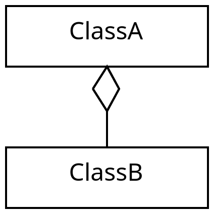

# What does the arrows mean?
This guide will relate C# code to the arrows found in UML class diagrams. This guide is not intended as a way to learn UML class diagrams, it is just meant as a supplement to other resources. An alternative resource to understand UML class diagrams can be found [here](https://www.visual-paradigm.com/guide/uml-unified-modeling-language/uml-class-diagram-tutorial/).

# Inheritance
An example of when an inheritance relationship can occur is.
```csharp
class ClassA {

}

class ClassB : ClassA {
  
} 
```
The inheritance arrow is used since `ClassB` inherits from `ClassA` which can be expressed as an UML class diagram below.

<p align="center">
  
</p>

# Aggregation
An example of when an aggregation relationship can occur is.
```csharp
class ClassA {
    public ClassB class_b;
}

class ClassB {
    
} 
```
The aggregation arrow is used if `ClassB` is part of `ClassA`, but they have seperate life spans. This means that `ClassA` can stop existing while `ClassB` can keep existing. So if you consider the following piece of code. 
```
var a = new ClassA();
var b = new ClassB();
a.class_b = b;
a = null;
```
Then at the last line of the code the instance of `ClassA` has stopped existing but the instance of `ClassB` is still available. This relation can be expressed using the following arrow.

<p align="center">
  
</p>

# Multiplicity
An example of when multiplicity can occur is.
```csharp
class ClassA {
    public List<ClassB> bs = new List<ClassB>(); 
}

class ClassB {
  
} 
```
Multiplicity is used to denote the quantities of classes in the relationships. In the above example a single `ClassA` has many `ClassB` instances. In the diagram below you can see how this is shown.

<p align="center">
  
</p>

# Composition
An example of when a composition relationship can occur is.
```csharp
class ClassA {
    private ClassB class_b = new ClassB();
}

class ClassB {
    
} 
```
The composition arrow is used if `ClassB` is part of `ClassA` and they have the same life span. This means that if an instance of `ClassA` stops existing then its instance of `ClassB` will stop existing. If a public field was used then they would not necessarily have the same life span. An example of this piece of code can be expressed as an UML class digram can be seen below.

<p align="center">
  
</p>

# Dependency
An example of when a dependency relationship can occur is.
```csharp
class ClassA {
    public void Print() {
        Console.WriteLine("test");
    }    
}

class ClassB {
    public void UsePrint(ClassA a) {
        a.Print();
    } 
} 
```
The dependency arrow is used when a class is dependent on another class without storing the class in a field. In the example above `ClassB` depends on `ClassA` in the sense that if you changed `ClassA` such that `Print` did not exist then `ClassB` would break. Also since `ClassB` does not store an instance of `ClassA` the dependency is less strong than an aggregation or a composition. Below is a diagram expressing the code. 

<p align="center">
  
</p>

# Realization
An example of when a realization relationship can occur is.
```csharp
interface IInterfaceA {
}

class ClassB : IInterfaceA {
    
} 
```
The realization arrow is used when a class implements some blueprint. As an example the blueprint can specify a set of methods that must be implemented such  that the implementation is fulfilled for that class. This commonly happens when an interface or an abstract class is used. In the code above `ClassB` implements `IInterfaceA` which does not need any fields or methods to be implemented. The diagram below shows an UML class diagram expressing the code.

<p align="center">
  
</p>
