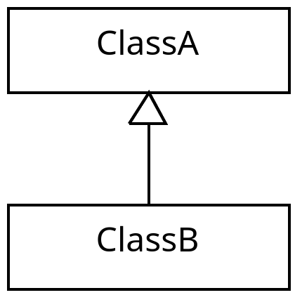
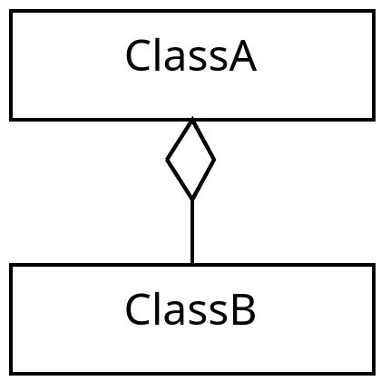
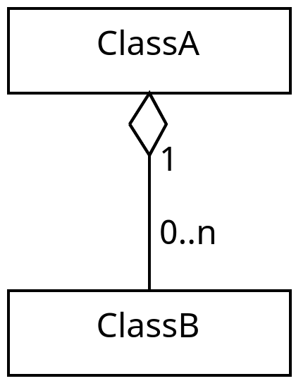
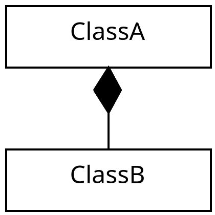
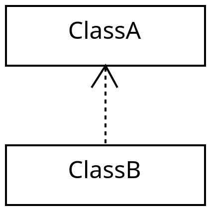
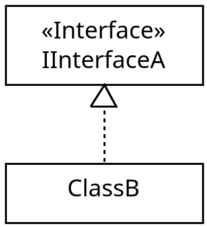

# What do the arrows mean in JavaScript?
This guide relates JavaScript code to the arrows found in UML class diagrams. This guide is not intended as a way to learn UML class diagrams, it is just meant as a supplement to other resources. An alternative resource to understand UML class diagrams can be found [here](https://www.visual-paradigm.com/guide/uml-unified-modeling-language/uml-class-diagram-tutorial/).

# Inheritance
An example of when an inheritance relationship can occur is.
```javascript
class ClassA {

}

class ClassB extends ClassA {

}
```
The inheritance arrow is used since `ClassB` inherits from `ClassA`, which can be expressed as a UML class diagram below.

<p align="center">
  
</p>

# Aggregation
An example of when an aggregation relationship can occur is.
```javascript
class ClassA {
    constructor() {
        this.classB = null;
    }
}

class ClassB {

}
```
The aggregation arrow is used if `ClassB` is part of `ClassA`, but they have separate life spans. This means that `ClassA` can stop existing while `ClassB` can keep existing. So if you consider the following piece of code.
```javascript
let a = new ClassA();
const b = new ClassB();
a.classB = b;
a = null;
```
Then, executing the last line of the code, the instance of `ClassA` has been dereferenced and is inaccessible using the variable `a`, but the instance of `ClassB` is still available through the variable `b`. This relation can be expressed using the following arrow.

<p align="center">
  
</p>

# Multiplicity
An example of when multiplicity can occur is.
```javascript
class ClassA {
    constructor() {
        this.bs = [];
    }
}

class ClassB {

}
```
Multiplicity is used to denote the quantities of classes in the relationships. In the above example a single `ClassA` has many `ClassB` instances. In the diagram below you can see how this is shown.

<p align="center">
  
</p>

# Composition
An example of when a composition relationship can occur is.
```javascript
class ClassA {
    constructor() {
        this.classB = new ClassB();
    }
}

class ClassB {

}
```
The composition arrow is used if `ClassB` is part of `ClassA` and they have the same life span. This means that if an instance of `ClassA` stops existing then its instance of `ClassB` will stop existing. If the object were assigned from outside the class then they would not necessarily have the same life span. An example of this piece of code expressed as a UML class diagram can be seen below.

<p align="center">
  
</p>

# Dependency
An example of when a dependency relationship can occur is.
```javascript
class ClassA {
    print() {
        console.log("test");
    }
}

class ClassB {
    usePrint(a) {
        a.print();
    }
}
```
The dependency arrow is used when a class is dependent on another class without storing the class in a field. In the example above, `ClassB` depends on `ClassA` in the sense that if you changed `ClassA` such that `print` did not exist then `ClassB` would break. Also, since `ClassB` does not store an instance of `ClassA`, the dependency is less strong than an aggregation or a composition. Below is a diagram expressing the code.

<p align="center">
  
</p>

# Realization
An example of when a realization-like relationship can occur is.
```javascript
class InterfaceA {
    requiredMethod() {
        throw new Error("requiredMethod must be implemented");
    }
}

class ClassB extends InterfaceA {
    requiredMethod() {
        console.log("implemented");
    }
}
```
The realization arrow is used when a class implements some blueprint. JavaScript does not have built-in interfaces, but a base class can be used to express a similar blueprint by defining methods that subclasses are expected to implement. In the code above, `ClassB` fulfills the blueprint represented by `InterfaceA`. The diagram below shows a UML class diagram expressing the code.

<p align="center">
  
</p>
